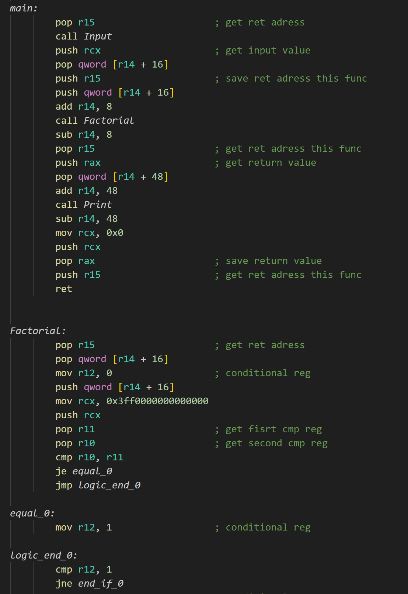

# Language

## Описание

Данный проект проект представляет собой компилятор моего собственного языка программирования. Работа над языком состояла из нескольких этапов:
- Frontend:  
   1. Разработка стандарта AST (abstract syntax tree)  
   2. Реализация лексера и парсера собственного языка программирования 
- Backend:
   1. Перевод AST в IR
   2. Трансляция из IR в NASM (x86-64)
- Reverse Frontend:
   1. Получение кода на языке программирования из AST для кросс-трансляции с другими языками программирования, имеющими такой же стандарт

> [!NOTE]
> Поскольку стандарт был разработал командой из нескольких участников, cуществует еще один этап: Middleend, который представляет из себя оптимизацию дерева, полученного на этапе Frontend. Подробнее об этом поговорим позже

## Скачивание и запуск программы

### Скачивание

В первую очередь нужно выполнить клонирование репозитория на свой компьютер выполнив следующую команду:

``` bash
git clone https://github.com/Amlola/Language
```

### Запуск
Для начала создайте 2 файла в папке с репозиторием. Первым из них будет файл с программой (input.txt), второй файл (output.txt), который будет содержать текстовое представление дерева
Для сборки выполните следующую команду: 
```bash
sh run_asm.sh input.txt output.txt 
```

## Frontend

 Как уже говорилось, стандарт языка создавался командной, с ним можно ознакомиться по [этой ссылке](https://github.com/Iprime111/LanguageStandart).  

 ### Синтаксис языка

Синтаксис языка схож с языком 'C', представляет из себя набор ключевых слов.

Список ключевых слов (not finished):

| Имя              |Описание           | Примеры
|:-----------------|-------------------|-------------------------------------------------------------------------------------------------|
| input            | выполняет ввод из стандартного потока ввода (stdin) |  int a = input();                                              |
| print            | выводит в стандартный поток вывода (stdout) |          print(a + b);                                                 |
| sqrt             | вовзращает квадратный корень от выражения внутри скобок | int b = sqrt(4);                                          |
| int              | объявляет переменную/функцию типа int (на самом деле реализован формат чисел с фиксированной точкой) |   int a = 6.23;      |
| while            | оператор цикла с предварительным логическим условием    |    while (a > 6)                                          |
| break           |  оператор выхода из цикла |   break;            |
| continue          | оператор перехода на следующую итерацию цикла     |       continue;                                     |
| type/sent            | аналог { } для выделения тела функции         |                                               |
| ;            | оператор последовательного исполнения        |   |
| if/else            | условные операторы        |   |


Пример программмы вычисления факториала числа на моем языке:
~~~ C++
int main()
type
    int a = input();
    
    print(Factorial(a));

    return 0;
sent
   
int Factorial(int a)
type
    if (a == 1)
    type
        return 1;
    sent

    return Factorial(a - 1) * a;
sent
~~~

### Лексер
Первым этапом работы над Frontend'ом был токенизатор для разбиения текста программы на отдельные лексемы, что позволило в дальнейшем упростить обработку конструкций языка. А также он позволил
перед работой парсера находить синтаксические ошибки (например, имя индентификатора начато с цифры). Лексемы сохранялись в двусвязный список на индексах, собственной реализации ([ссылка на него](https://github.com/Amlola/List)).

### Синтаксический Парсер

Для получения AST был реализован алгоритм рекурсивного спуска. Для упрощения создания дерева был создан DSL, позволяющий компактно добавлять новый узел дерева. В результате работы парсера получалось следующее синтаксическое
дерево (пример программы вычисления факториала):


Также была проведена работа над обработкой синтаксических ошибок:
  1. Неинециализированная переменная
  2. Отсутствие оператора последовательного исполнения
  3. Имя идентификатора совпадает с именем ключевого слова
  4. Ошибка области видимости переменной
  5. Ошибки, связанные с неправильной скобочной последовательностью
  6. Ошибки, связанные с объявлением функции (с оператором перечисления)
  7. Ошибки с оператором присваивания
  8. Исползование else без if

При обнаружении ошибки выводится следующее сообщение:


### Таблица имен

Важным этапом работы Frontend'a было написание некоторой структуры, содержащей всю информацию об идентификаторах программы. Она упрощала работа с областью видимости программы и делала возможным создание локальных
и глобальных переменных. Описание таблицы имен также представлено в [стандарте языка](https://github.com/Iprime111/LanguageStandart). При работе с лексером идентификаторы добавлялись в общую таблицу имен. А уже при
рекурсивном спуске каждый идентификатор единоразово добавлялся в локальные таблицы (по сути локальная таблица - это список идентификаторов в функции).

Таким образом, в результате работы Frontend'a на выходе я получал два файла: текстовое представление AST и файл с таблицей имен.

## Middleend
`Middleend` является этапом оптимизации синтаксического дерева. По сути, эти оптимизации были реализованы в моем проекте, связанном с дифференцированием математического выражения (ознакомиться можно
[по этой ссылке](https://github.com/Amlola/Differentiator)).  В этом проекте реализованы простейшие оптимизации:
- свёртка константных выражений
- упрощение математических выражений

Но как уже говорилось, была реализована кросс-трансляция с другими участниками разработки стандарта языка, поэтому я использовал не свой Middleend, просто передавая на вход свои файлы (AST, таблица имен).

## Backend
### Трансляция в IR
Промежуточное представление компилятора представляет собой массив двусвязных списков для каждой функции. Тем самым перед перед началом трансляции, непосредственно, в NASM, можно провести оптимизации (например, удаление подряд идущих push/pop и т.д). Подробнее структуру можно изучить в файле [Ir_struct.h](Backend/inc/Ir_struct.h). Для упрощения добавления узла в список был реализован DSL, который представлен в файле [back_dsl.h](Backend/inc/back_dsl.h). А также, в поле структуры были добавлены комментарии, для того, чтобы было понятнее анализировать код на ассемблере.

### Трансляция в NASM
Пример отрывка программы вычисления факториала числа на ассемблере:  



Для начала была написана своя библиотека `stdlib.s` для функций `print` и `input`, поддерживающая вычисления с фиксированной точкой. Поэтому для вычислений использовались `xmm` регистры. 
Также опишу принцип работы с регистрами в моем проекте.

| Регистр                   |   Описание   |
|:--------------------------|:-------------:|
|**r14**                    | для доступа к переменным используется смещение относительно этого регистра|
|**r15**                    | сохраняет адрес возврата функции при вызове|
|**r11/r10**              | регистры сравнения при логических выражениях| 
|**r12**                | используется для хранения результата логического выражения|
|**rax**                 | хранит возвращаемое значение функции          | 
|**rcx**                 | используется для промежуточных вычислений      |  

